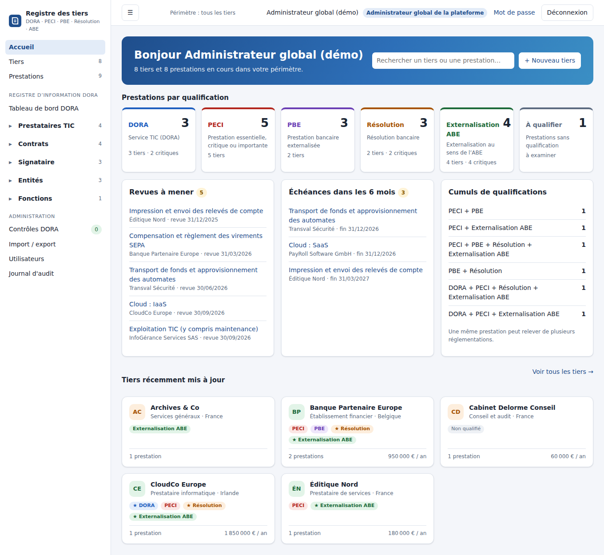
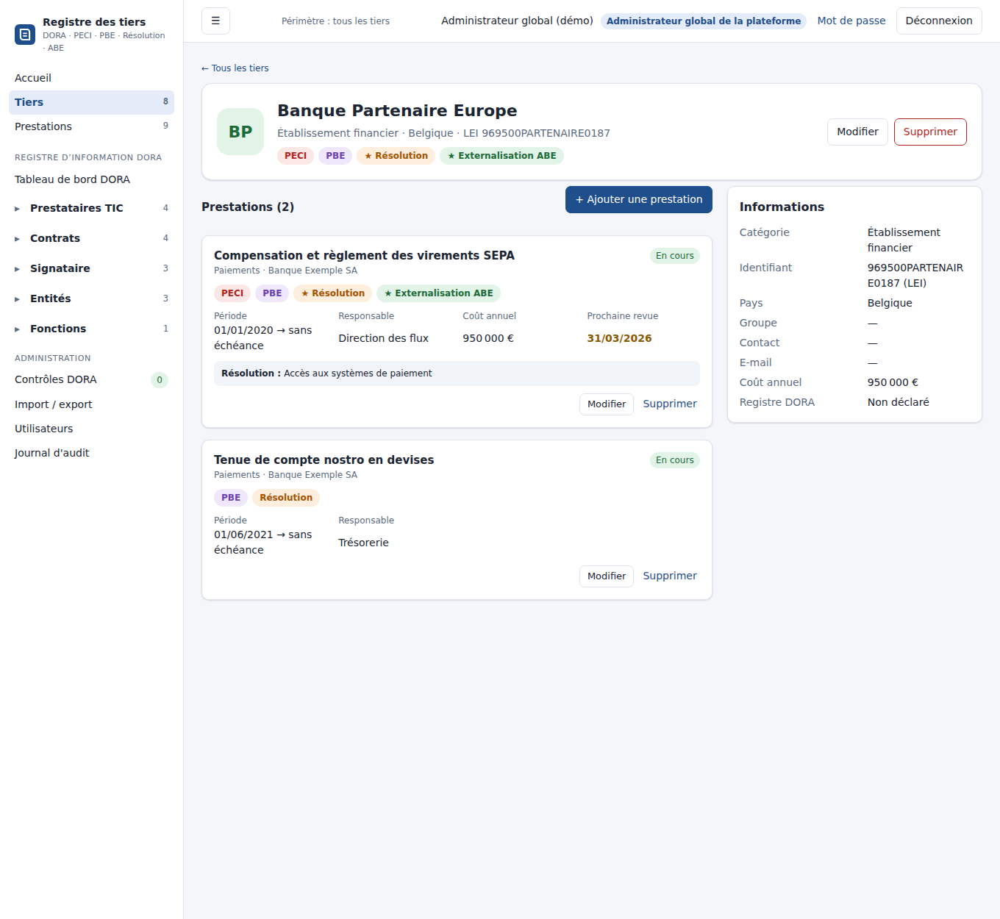
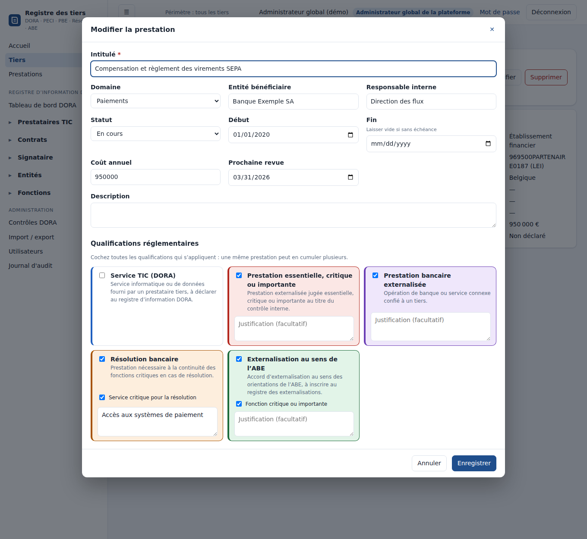
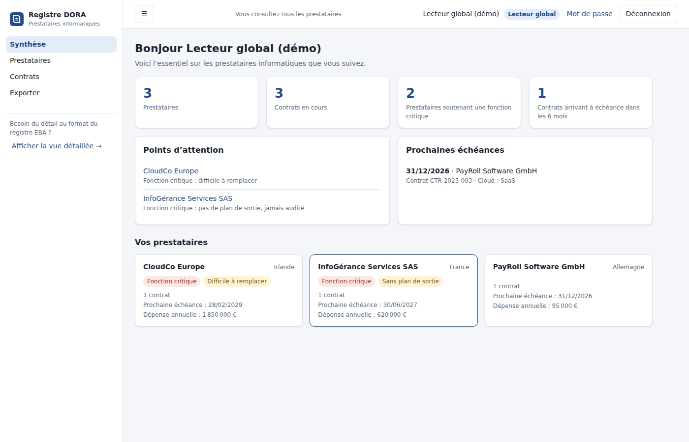

# Registre des tiers – DORA, PECI, PBE, Résolution, Externalisation ABE

Application web de suivi de **tous les tiers** de l'entreprise et de leurs **prestations**, qu'elles
relèvent de DORA ou non. Chaque prestation porte ses qualifications réglementaires, cumulables :

| Qualification | Signification |
| --- | --- |
| **DORA** | Service TIC fourni par un prestataire tiers, à déclarer au registre d'information DORA |
| **PECI** | Prestation essentielle, critique ou importante |
| **PBE** | Prestation bancaire externalisée |
| **Résolution** | Prestation nécessaire à la continuité des fonctions critiques en cas de résolution |
| **Externalisation ABE** | Accord d'externalisation au sens des orientations de l'ABE |

Une même prestation peut être à la fois DORA et PECI, par exemple ; DORA, Résolution et ABE
permettent en plus de signaler la prestation comme critique (★).

L'application tient aussi le **registre d'information DORA** (article 28 du règlement (UE) 2022/2554)
au format du template EBA « Register of Information » (`template/dora-roi-template.xlsb`) : les
14 tableaux b_01.01 à b_07.01, leurs colonnes, consignes et listes de valeurs.



## Tiers et prestations

- **Accueil** : prestations par qualification, revues à mener dans les 30 jours, échéances à 6 mois,
  cumuls de qualifications, tiers récemment mis à jour.
- **Tiers** : fiches en cartes avec recherche, filtre par catégorie et par qualification.
- **Fiche tiers** : informations du tiers et ses prestations (période, responsable, coût, prochaine
  revue, qualifications et justifications) ; lien vers la fiche du registre DORA quand le tiers y figure.
- **Prestations** : liste filtrable par qualification et par statut.
- **Export Excel** des tiers et prestations (une colonne par qualification).
- **Reprise du registre DORA** : chaque prestataire TIC (b_05.01) devient un tiers et chaque accord
  (b_02.02) une prestation qualifiée DORA, automatiquement après chaque import du registre.





## Profils

| Profil | Lecture | Écriture | Administration |
| --- | --- | --- | --- |
| **Administrateur global de la plateforme** | Tous les tiers et tout le registre | Tous les tiers et prestations ; tout le registre, y compris le référentiel (entités b_01.xx, fonctions b_06.01) | Utilisateurs, rattachements, import Excel, journal d'audit |
| **Lecteur global** | Tous les tiers et tout le registre | — | — |
| **Administrateur de tiers** | Ses tiers et prestataires rattachés + référentiel | Ses tiers et leurs prestations ; données DORA de ses prestataires (accords, signataires, utilisateurs, chaîne d'approvisionnement, évaluations) ; peut créer un tiers ou déclarer un prestataire, qui lui est alors rattaché | — |
| **Lecteur des tiers rattachés** | Ses tiers et prestataires rattachés + référentiel | — | — |

Un utilisateur rattaché voit les tiers qui lui sont rattachés directement et ceux qui correspondent à
ses prestataires TIC du registre DORA.

Dans la partie « Registre d'information DORA », les deux profils **lecteurs** ont une **vue simplifiée**, sans tableaux ni codes EBA :
une synthèse (chiffres clés, points d'attention sur les prestataires critiques, prochaines échéances),
des fiches prestataires en langage clair (contrats, fonctions soutenues, localisation des données,
remplaçabilité, plan de sortie, dernier audit, sous-traitants), la liste des contrats avec leur statut,
et l'export Excel. Un lien « Afficher la vue détaillée » donne accès, en lecture, aux tableaux du registre.



Le **périmètre d'un tiers** est calculé à partir des codes prestataires (b_05.01.0010) rattachés à
l'utilisateur : lignes b_05.01 correspondantes, accords où le prestataire apparaît (b_02.02, b_03.02)
et toutes les lignes portant ces références d'accord (b_02.01, b_02.03, b_03.01, b_03.03, b_04.01,
b_05.02), évaluations b_07.01 du prestataire. Le référentiel (entités, succursales, fonctions) reste
lisible par tous pour permettre la saisie. Tous les exports respectent ce périmètre.

## Fonctionnalités

- **Saisie guidée** de chaque tableau : libellés français, code EBA de la colonne, consigne officielle,
  listes déroulantes EBA (pays, devises, types de services de l'annexe III…), suggestions pour les
  références croisées (accords, LEI des entités, prestataires, fonctions) et remplissage automatique du
  type de code du prestataire.
- **Fiche prestataire** consolidée (b_05.01 + accords + évaluations + chaîne d'approvisionnement) et
  assistant de création d'un accord (b_02.01 + b_02.02 en une fois).
- **Contrôles** : formats (LEI avec clé ISO 17442, dates ISO 8601, entiers, montants, `LEI` /
  `EUID`, `PAYS_TYPE`, `Fn`), champs obligatoires et conditionnels du template, références entre tableaux,
  cohérence du type de code avec b_05.01, doublons de clé.
- **Export Excel au format du template** : un onglet par tableau, codes colonnes en ligne 4, libellés
  en ligne 5, types en ligne 6, données à partir de la ligne 7, valeurs codées EBA (`eba_GA:FR`…),
  onglet « Drop down » et listes déroulantes de validation.
- **Import Excel** (.xlsx, en ajout ou en remplacement ; libellés ou codes acceptés) au format du template
  ou au **format de remise EBA** (DPM 4.0 : onglets `b_05_01`, codes `c0010` en ligne 1, types de code
  `eba_qCO:qx2000`…). Pour ce dernier, les colonnes de b_05.01 sont réalignées sur le template
  (le code complémentaire et le nom en alphabet latin ne sont pas repris) et les types de code sont
  convertis en `LEI`, `EUID` ou `PAYS_TYPE` (pays du siège du prestataire).
- **Journal d'audit** des connexions, créations, modifications (avant/après), suppressions, imports et
  exports.

## Démarrage

Prérequis : Node.js 22.13 ou plus récent (base SQLite intégrée `node:sqlite`, aucune dépendance native).

```bash
npm install
npm run demo     # base en mémoire avec données et comptes fictifs
```

Comptes de démonstration (mot de passe `Demo-DORA-2026`) : `admin.global`, `lecteur.global`,
`admin.tiers` (Transval Sécurité, CloudCo Europe, PayRoll Software GmbH), `lecteur.tiers` (Éditique Nord,
InfoGérance Services SAS).

En exploitation :

```bash
ADMIN_PASSWORD='un-mot-de-passe-solide' npm start
```

| Variable | Défaut | Rôle |
| --- | --- | --- |
| `PORT` | `3000` | Port HTTP |
| `HOST` | `127.0.0.1` | Interface d'écoute |
| `DB_PATH` | `data/registre.db` | Fichier SQLite |
| `ADMIN_USER` / `ADMIN_PASSWORD` | `admin` / aléatoire affiché au premier démarrage | Compte administrateur global créé si la base est vide |
| `SECURE_COOKIES` | — | `1` pour ajouter l'attribut `Secure` au cookie de session (derrière HTTPS) |

## Tests

```bash
npm test
```

Les tests couvrent la validation des formats, les droits de chacun des quatre profils, le calcul de
périmètre (registre et tiers), les qualifications cumulables, la reprise du registre DORA, les contrôles
de cohérence et l'aller-retour export → import Excel.

## Structure

```
template/dora-roi-template.xlsb   template EBA d'origine
scripts/extract_template.py       extraction des tableaux, consignes et listes → server/schema.json
server/schema.js                  schéma enrichi (libellés FR, obligatoire/conditionnel, références)
server/access.js                  profils et périmètre des tiers rattachés
server/checks.js                  contrôles de complétude et de cohérence
server/xlsx.js                    export / import au format du template
server/tiers.js                   tiers, prestations, reprise du registre DORA, export Excel des tiers
server/app.js                     API HTTP et fichiers statiques
public/                           interface web (HTML/CSS/JS sans framework)
public/shared/validate.js         règles de format partagées navigateur / serveur
public/shared/tiers-model.js      qualifications, catégories et contrôles des tiers et prestations
```

Pour mettre à jour le template EBA : remplacer `template/dora-roi-template.xlsb` puis
`pip install pyxlsb && npm run extract-template`.

## Sécurité

Mots de passe hachés (scrypt), sessions en cookie `HttpOnly` / `SameSite=Strict` expirant après 8 h,
limitation des tentatives de connexion, en-tête anti-CSRF obligatoire sur les requêtes de modification,
Content-Security-Policy stricte, contrôle des droits côté serveur sur chaque lecture et écriture.
