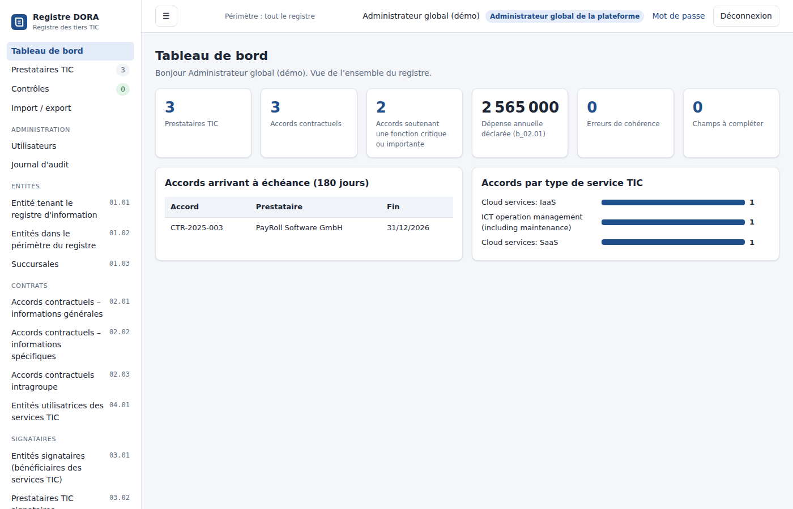

# Registre d'information DORA – registre des tiers TIC

Application web de tenue du **registre d'information DORA** (article 28 du règlement (UE) 2022/2554),
construite à partir du template EBA « Register of Information » (`template/dora-roi-template.xlsb`).
Elle reprend les 14 tableaux du template (b_01.01 à b_07.01), leurs colonnes, consignes et listes de
valeurs, et propose quatre profils d'utilisateur.



## Profils

| Profil | Lecture | Écriture | Administration |
| --- | --- | --- | --- |
| **Administrateur global de la plateforme** | Tout le registre | Tout le registre, y compris le référentiel (entités b_01.xx, fonctions b_06.01) | Utilisateurs, rattachements, import Excel, journal d'audit |
| **Lecteur global** | Tout le registre | — | — |
| **Administrateur de tiers** | Ses prestataires rattachés + référentiel | Données de ses prestataires (accords, signataires, utilisateurs, chaîne d'approvisionnement, évaluations) ; peut déclarer un nouveau prestataire, qui lui est alors rattaché | — |
| **Lecteur des tiers rattachés** | Ses prestataires rattachés + référentiel | — | — |

Les deux profils **lecteurs** arrivent sur une **vue simplifiée**, sans tableaux ni codes EBA :
une synthèse (chiffres clés, points d'attention sur les prestataires critiques, prochaines échéances),
des fiches prestataires en langage clair (contrats, fonctions soutenues, localisation des données,
remplaçabilité, plan de sortie, dernier audit, sous-traitants), la liste des contrats avec leur statut,
et l'export Excel. Un lien « Afficher la vue détaillée » donne accès, en lecture, aux tableaux du registre.


Le **périmètre d'un tiers** est calculé à partir des codes prestataires (b_05.01.0010) rattachés à
l'utilisateur : lignes b_05.01 correspondantes, accords où le prestataire apparaît (b_02.02, b_03.02)
et toutes les lignes portant ces références d'accord (b_02.01, b_02.03, b_03.01, b_03.03, b_04.01,
b_05.02), évaluations b_07.01 du prestataire. Le référentiel (entités, succursales, fonctions) reste
lisible par tous pour permettre la saisie. Tous les exports respectent ce périmètre.

## Fonctionnalités

- **Saisie guidée** de chaque tableau : libellés français, code EBA de la colonne, consigne officielle,
  listes déroulantes EBA (pays, devises, types de services de l'annexe III…), suggestions pour les
  références croisées (accords, LEI des entités, prestataires, fonctions) et remplissage automatique du
  type de code du prestataire.
- **Fiche prestataire** consolidée (b_05.01 + accords + évaluations + chaîne d'approvisionnement) et
  assistant de création d'un accord (b_02.01 + b_02.02 en une fois).
- **Contrôles** : formats (LEI avec clé ISO 17442, dates ISO 8601, entiers, montants, `LEI` /
  `PAYS_TYPE`, `Fn`), champs obligatoires et conditionnels du template, références entre tableaux,
  cohérence du type de code avec b_05.01, doublons de clé.
- **Export Excel au format du template** : un onglet par tableau, codes colonnes en ligne 4, libellés
  en ligne 5, types en ligne 6, données à partir de la ligne 7, valeurs codées EBA (`eba_GA:FR`…),
  onglet « Drop down » et listes déroulantes de validation.
- **Import Excel** (.xlsx au même format, en ajout ou en remplacement ; libellés ou codes acceptés).
- **Journal d'audit** des connexions, créations, modifications (avant/après), suppressions, imports et
  exports.

## Démarrage

Prérequis : Node.js 22.13 ou plus récent (base SQLite intégrée `node:sqlite`, aucune dépendance native).

```bash
npm install
npm run demo     # base en mémoire avec données et comptes fictifs
```

Comptes de démonstration (mot de passe `Demo-DORA-2026`) : `admin.global`, `lecteur.global`,
`admin.tiers` (CloudCo Europe, PayRoll Software GmbH), `lecteur.tiers` (InfoGérance Services SAS).

En exploitation :

```bash
ADMIN_PASSWORD='un-mot-de-passe-solide' npm start
```

| Variable | Défaut | Rôle |
| --- | --- | --- |
| `PORT` | `3000` | Port HTTP |
| `HOST` | `127.0.0.1` | Interface d'écoute |
| `DB_PATH` | `data/registre.db` | Fichier SQLite |
| `ADMIN_USER` / `ADMIN_PASSWORD` | `admin` / aléatoire affiché au premier démarrage | Compte administrateur global créé si la base est vide |
| `SECURE_COOKIES` | — | `1` pour ajouter l'attribut `Secure` au cookie de session (derrière HTTPS) |

## Tests

```bash
npm test
```

Les tests couvrent la validation des formats, les droits de chacun des quatre profils, le calcul de
périmètre, les contrôles de cohérence et l'aller-retour export → import Excel.

## Structure

```
template/dora-roi-template.xlsb   template EBA d'origine
scripts/extract_template.py       extraction des tableaux, consignes et listes → server/schema.json
server/schema.js                  schéma enrichi (libellés FR, obligatoire/conditionnel, références)
server/access.js                  profils et périmètre des tiers rattachés
server/checks.js                  contrôles de complétude et de cohérence
server/xlsx.js                    export / import au format du template
server/app.js                     API HTTP et fichiers statiques
public/                           interface web (HTML/CSS/JS sans framework)
public/shared/validate.js         règles de format partagées navigateur / serveur
```

Pour mettre à jour le template EBA : remplacer `template/dora-roi-template.xlsb` puis
`pip install pyxlsb && npm run extract-template`.

## Sécurité

Mots de passe hachés (scrypt), sessions en cookie `HttpOnly` / `SameSite=Strict` expirant après 8 h,
limitation des tentatives de connexion, en-tête anti-CSRF obligatoire sur les requêtes de modification,
Content-Security-Policy stricte, contrôle des droits côté serveur sur chaque lecture et écriture.
